import Tabs from '@theme/Tabs';
import TabItem from '@theme/TabItem';

# Getting Started

The ModioUGC plugin is composed of two core components: `UUGCSubsystem`, which handles UGC discovery and loading, and `IUGCProvider`, which interacts with UGC providers to determine availability and locate UGC packages.

## UGC Subsystem

The **UGC Subsystem** is the central system that powers the ModioUGC plugin. Its lifetime is automatically managed by the engine, offering a convenient and reliable entry point for interacting with the plugin's functionality.

### Responsibilities

The UGC Subsystem is broadly responsible for:

- Managing the plugin lifecycle (initialization and teardown)
- Setting and initializing UGC provider(s)
- Discovering and loading UGC packages
- Refreshing UGC availability on demand

### Key Methods

The subsystem provides the following key methods:

- `SetUGCProvider`
- `InitializeUGCProvider`
- `RefreshUGC`
- `UnloadAllUGCPackages`

These methods are used to configure and control the discovery and loading of UGC. Additional helper methods are also available for interacting with other aspects of the system.

:::note
The UGC Subsystem itself is managed automatically by the engine, so manual instantiation is not required.
:::


## UGC Provider

The `IUGCProvider` interface is responsible for supplying information about the UGC content to be mounted. Depending on your game's architecture, you may use a single provider or aggregate multiple providers into one.

The core method, `GetInstalledUGCPaths`, defines the directories the system should scan to discover UGC. These paths must point to locations containing a `.uplugin` file alongside its associated UGC files (e.g., `.pak`, `.ucas`, `.utoc`) within a `Content` directory.

### Example

If your `.uplugin` file is located at `C:\MyUGCFolder\RedSpaceship.uplugin` and the UGC files are located in `C:\MyUGCFolder\Content\Paks\Windows\`, then the path returned by `GetInstalledUGCPaths` should be `C:\MyUGCFolder`.

### Included Providers

The plugin includes two example implementations:

- **`UModioUGCProvider`**  
  This is the default provider. It can automatically initialize the mod.io service (if enabled in the ModioUGC settings) and returns installed UGC paths from the mod.io user installation directory using `GetInstalledUGCPaths`.

- **`USideLoadUGCProvider`**  
  This sample provider returns a specific directory path for sideloading UGC. It's useful for testing during development without needing to initialize or authenticate with mod.io.

:::note
You can implement your own custom provider by inheriting from `IUGCProvider` and overriding the `GetInstalledUGCPaths` method to suit your game's content workflow.
:::

<Tabs group-id="languages">
<TabItem value="blueprint" label="Blueprint">

When using Blueprint, subclass `UObject` and implement the `IUGCProvider` interface. The following functions should be implemented: `InitializeProvider`, `DeinitializeProvider`, `IsProviderEnabled`, and `GetInstalledUGCPaths`.

Ensure two dispatchers are created with appropriate checks for your provider, `InitializeProvider_Dispatcher` and `DeinitializeProvider_Dispatcher`. In this case we're just returning an immediate success.


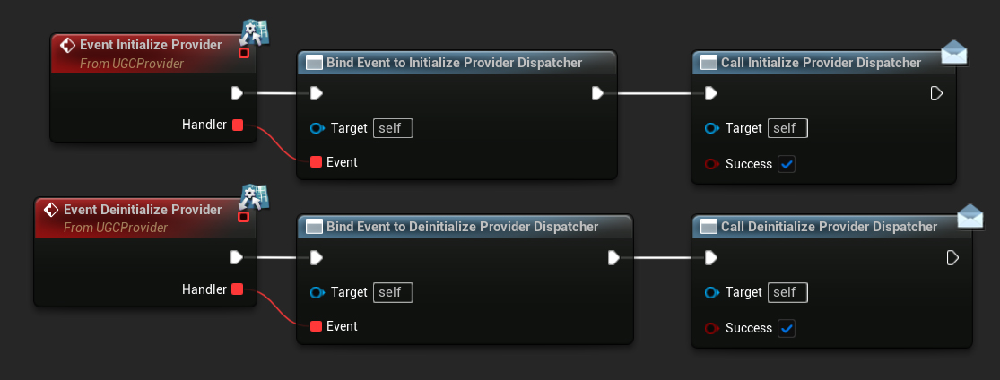

Implement `GetInstalledUGCPaths` to return the UGC path representing the packaged UGC. 
For example the mod.io user installations:

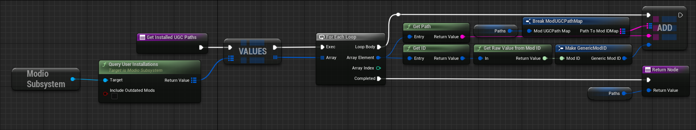

Or a side load directory, which can be useful during development:
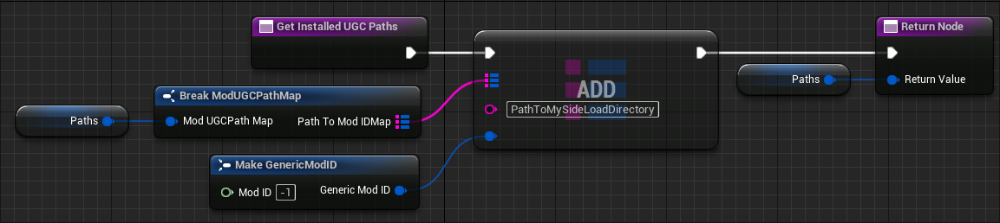

</TabItem>
<TabItem value="c++" label="C++" default>
Implement `GetInstalledUGCPaths` to return the UGC path representing the packaged UGC. 
For example the mod.io user installations:
 ```cpp
FModUGCPathMap UMyUGCProvider::GetInstalledUGCPaths_Implementation()
{
	TMap<FString, FGenericModID> UGCPathsToModIDs;
	if (UModioSubsystem* Subsystem = GEngine->GetEngineSubsystem<UModioSubsystem>())
	{
		TMap<FModioModID, FModioModCollectionEntry> InstalledMods = Subsystem->QueryUserInstallations(true);
		for (const TPair<FModioModID, FModioModCollectionEntry>& Mod : InstalledMods)
		{
			UGCPathsToModIDs.Add(Mod.Value.GetPath(), FGenericModID(GetUnderlyingValue(Mod.Key)));
		}
	}
	return FModUGCPathMap(MoveTemp(UGCPathsToModIDs));
}
```
Or a side load directory, which can be useful during development:

 ```cpp
FModUGCPathMap UMyUGCProvider::GetInstalledUGCPaths_Implementation()
{
	TMap<FString, FGenericModID> UGCPathsToModIDs;

	// Scan folder for mods
	const FString BaseModsPath = TEXT("PathToMySideLoadDirectory");
	const FString ModsPathSearch = BaseModsPath / TEXT("*");

	IFileManager& FileManager = IFileManager::Get();
	TArray<FString> OutFolders;
	FileManager.FindFiles(OutFolders, *ModsPathSearch, false, true);

	for (const FString& Folder : OutFolders)
	{
		UGCPathsToModIDs.Add(BaseModsPath / Folder, FGenericModID());
	}

	return FModUGCPathMap(MoveTemp(UGCPathsToModIDs));
}
```
  </TabItem>
</Tabs>


## Initialization
### Manual

The general expectation is your game will handle the initialization of ModioUGC providers when appropriate. 

<Tabs group-id="languages">
<TabItem value="blueprint" label="Blueprint">
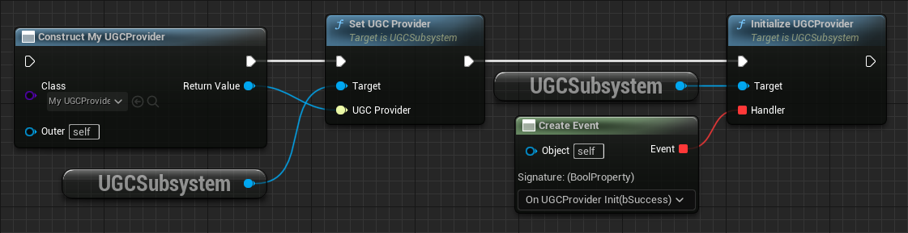
</TabItem>
<TabItem value="c++" label="C++" default>
```cpp
    UUGCSubsystem* UGCSubsystem = GEngine->GetEngineSubsystem<UUGCSubsystem>();
    if (UGCSubsystem)
    {
        UGCSubsystem->SetUGCProvider(NewObject<UMyCustomGame_UGCProvider>(this));

        FOnUGCProviderInitializedDelegate Handler;
        // Optionally bind a callback to handle the success/failure of the provider initialization
        Handler.BindDynamic(this, &UMyCustomGameSubsystem::OnUGCProviderInitialized);
        UGCSubsystem->InitializeUGCProvider(Handler);
    }
```
</TabItem>
</Tabs>

### Automatic
There is also an option to automatically perform initialization. This will create and set a new `UModioUGCProvider` object as soon as the UGC Subsystem initializes.

Navigate to **Edit > Project Settings > Plugins > mod.io UGC** and check the **Auto Initialize UGC Provider** option.
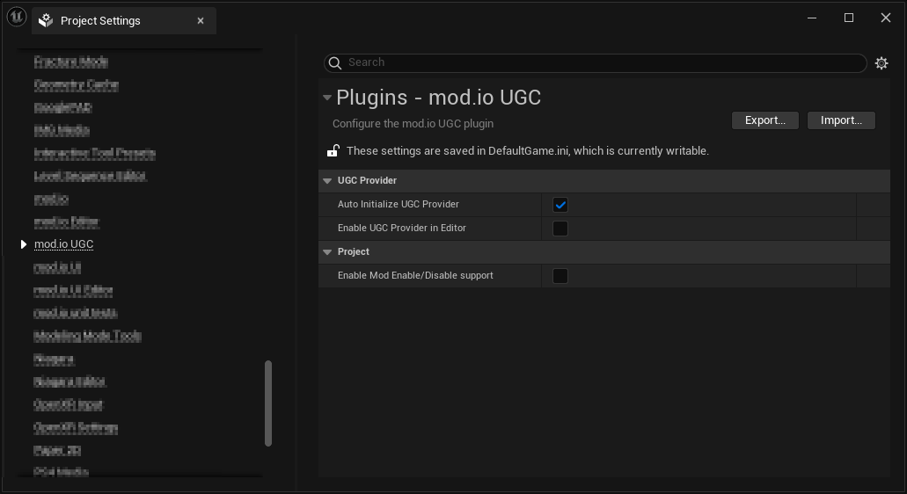


## Mounting and registering UGC assets

Once both the UGC Subsystem and your UGC Provider have been initialized, the system will automatically attempt to discover UGC when the Unreal Asset Manager is spawned. If the Asset Manager is already available, discovery begins immediately.

During this step, the system:

- Uses the paths provided by your `IUGCProvider`
- Discovers valid UGC packages
- Finds and mounts the contained `.pak` files

To trigger discovery manually, you can call `RefreshUGC` on the UGC Subsystem. This will re-scan for new UGC and unload any previously mounted UGC that is no longer available. This is useful, for example, after installing or uninstalling content via the UGC browser.

Once UGC has been successfully discovered and mounted, you are free to access the assets it contains.

## Accessing Assets

Once a UGC package is successfully mounted, you can access the assets within it using the following functions from the `UGCSubsystem`:

- **`EnumerateAllUGCPackages`**: This function invokes the provided functor on every UGC package in the registry. It is the only method to directly access the UGC packages.
- **`GetUGCPackageByModID`**: This function retrieves a UGC package by its mod ID.

Additionally, the assets are now registered with the `AssetManager` and appended to the `AssetRegistry`, which allows you to query them based on asset type. For instance, if your UGC includes maps, you can easily find them by querying for map assets.

### Using the Asset Manager

To query assets (for example maps) through the `AssetManager`, use the following approach:

```cpp
	TArray<TSoftObjectPtr<UObject>> MapList;
	UAssetManager& AssetManager = UAssetManager::Get();
	TArray<FPrimaryAssetId> OutAssetIDs;
	AssetManager.GetPrimaryAssetIdList(FPrimaryAssetType("Map"), OutAssetIDs);
	for (FPrimaryAssetId AssetID : OutAssetIDs)
	{
		FAssetData AssetData;
		AssetManager.GetPrimaryAssetData(AssetID, AssetData);

		if (AssetData.IsValid())
		{
			MapList.Add(TSoftObjectPtr<UObject>(AssetData.GetAsset()));
		}
	}
```

### Using the Asset Registry
Alternatively, you can use the `AssetRegistry` like so:

```cpp
	TArray<TSoftObjectPtr<UObject>> MapList;
	FAssetRegistryModule& AssetRegistryModule =
		FModuleManager::LoadModuleChecked<FAssetRegistryModule>("AssetRegistry");
	IAssetRegistry& AssetRegistry = AssetRegistryModule.Get();

	FARFilter ARFilter;
	TArray<FAssetData> AssetList;
	ARFilter.ClassPaths.Add(UWorld::StaticClass()->GetClassPathName());
	ARFilter.bIncludeOnlyOnDiskAssets = true; // This is important, otherwise UGC assets will not be found
    // Any other filter requirements

	FARCompiledFilter CompiledFilter;
	IAssetRegistry::Get()->CompileFilter(ARFilter, CompiledFilter);

	TArray<FAssetData> AssetDataArray;
	AssetRegistry.GetAssets(ARFilter, AssetDataArray);

	for (const FAssetData& AssetData : AssetDataArray)
	{
		MapList.Add(TSoftObjectPtr<UObject>(AssetData.GetAsset()));
	}
```


## Creating UGC

The ModioUGC plugin includes additional editor tooling to facilitate the creation and packaging of UGC content for deployment.

Clicking the **mod.io** button in the editor's top toolbar then selecting **Create & Upload** will open the mod.io editor window.

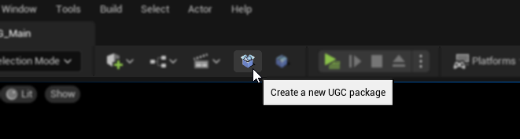

From here, you can select the **Create UGC** button to open a wizard for creating a content-only UGC plugin.

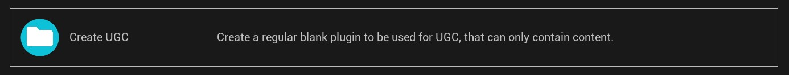

This process generates a new plugin structure for your UGC package. When creating content, avoid dependencies on engine assets, as this can cause issues during packaging.

After the UGC is created, content can be added by creating new assets or importing existing ones. This process is typically performed by UGC creators using the Unreal Editor or your provided mod kit, etc.

### Required Metadata

Each UGC package must include a `UUGC_Metadata` data asset, which is automatically generated during the creation process. This metadata defines:

- The **primary asset type**
- The **base asset class**
- The **content path**, usually set to the name of your UGC folder (since all assets should reside within it)

For example, if you're creating a new UGC map, it should match a defined primary asset type in your project's `AssetManager` settings to ensure it can be discovered and loaded correctly.

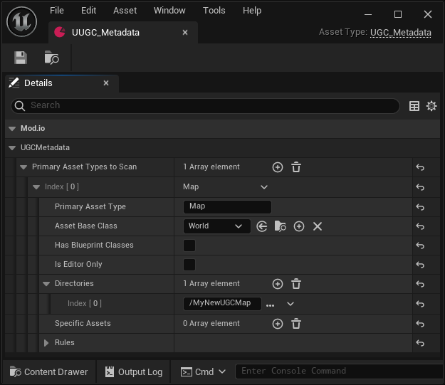
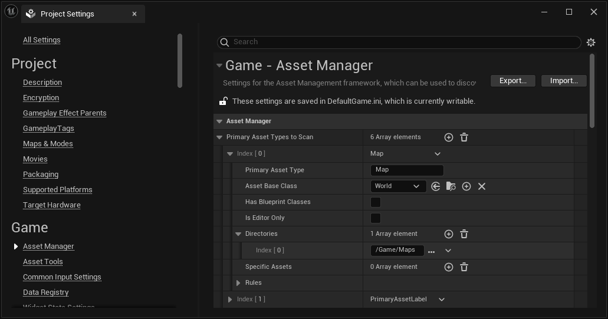


## Packaging UGC

The ModioUGC plugin provides a second editor tool for packaging UGC content as a cooked DLC plugin for a selected platform.

Clicking the **mod.io** button in the editor's top toolbar then selecting **Create & Upload** will open the mod.io editor window.


From here, you can select the **Package UGC** button to open a dialog where you can select the UGC plugin and the target platform for packaging.

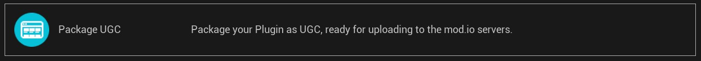

Once the packaging process is complete, a folder is generated containing:

- The `.uplugin` file
- A `Content` directory with:
  - The `.pak` file
  - (If Io Store is enabled) `.ucas` and `.utoc` files

This folder represents the packaged UGC and is ready to be mounted by the ModioUGC runtime.

You can also compress this folder into a `.zip` archive to upload to [mod.io](https://mod.io).

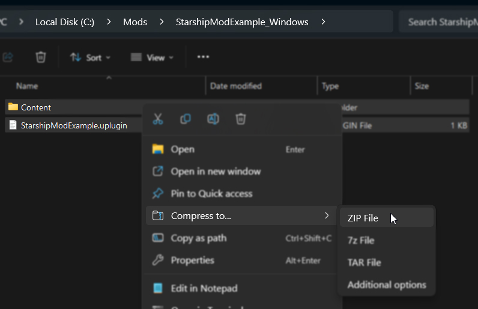  
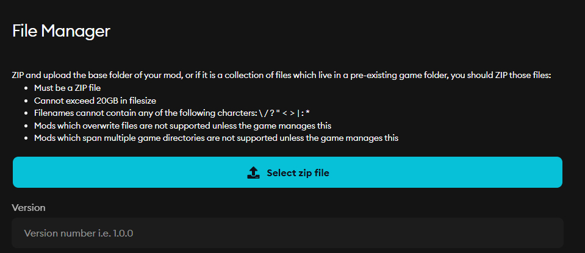


## In-editor testing

Testing can also be performed in-editor, although it is disabled by default. To enable it:

1. Navigate to **Edit > Project Settings > Engine -> Cooker** and check the **Allow Cooked Content In The Editor** option.

    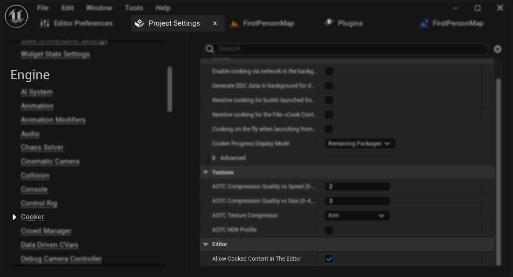

2. Navigate to **Edit > Project Settings > Plugins > UGC Settings** and check the **Enable UGC Provider in Editor** option.

    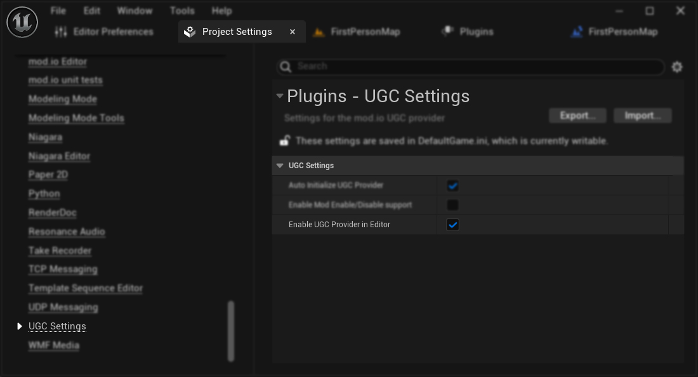

3. Open up your DefaultEngine.ini config file and add allowing unversioned content in editor to the Cooker Settings"

```text
[/Script/UnrealEd.CookerSettings]
s.AllowUnversionedContentInEditor=True
```

:::note
A current limitation for in-editor testing requires the project to have Io Store disabled both when creating the UGC, as well as when attempting to load it.
:::

To disable the Io Store, navigate to **Edit > Project Settings > Packaging** and set the **Use Io Store** option to **False**.

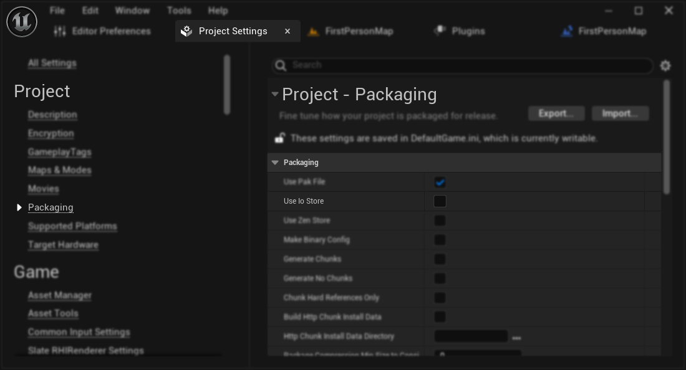

Also, please note that it's not possible to run the project with UGC packaged with Io Store enabled, and vice versa. UGC must be packaged with the same Io Store setting as the project.