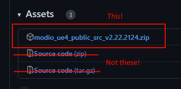

++++

++++

= mod.io Unreal Engine ModioUGC Plugin

image:https://img.shields.io/badge/license-MIT-brightgreen.svg[alt="License", link="https://github.com/modio/modio-sdk/blob/master/LICENSE"]
image:https://img.shields.io/discord/389039439487434752.svg?label=Discord&logo=discord&color=7289DA&labelColor=2C2F33[alt="Discord", link="https://discord.mod.io"]
image:https://img.shields.io/badge/docs-master-green.svg[alt="Master Docs", link="https://docs.mod.io/unreal/"]
image:https://img.shields.io/badge/Unreal-5.2%2B-green[alt="Unreal Engine", link="https://www.unrealengine.com"]

Welcome to the mod.io Unreal Engine ModioUGC repository. The ModioUGC is an Unreal Engine plugin designed to make it easy to add dynamic management of user-generated content in the form of PAK files to your game.

== Engine & Platform Compatibility

This plugin requires the core mod.io plugin to be installed alongside it. Support for both plugins is generally maintained to support the 3 most recent versions of Unreal Engine. 

=== Engine compatibility

|===
|Engine Version | Last Release
|UE5.3 | Current
|UE5.4 | Current
|UE5.5 | Current
|===

### Platform compatability

The ModioUGC plugin supports Windows, Linux, LinuxArm64, Mac, iOS and Android as part of the public release.

For access to Windows (GDK), XBox, Playstation 4, Playstation 5 or Switch, please https://docs.mod.io/support/contacts/[contact us].

== Features

* C++ and Blueprint support
* Permissive MIT/BSL-license
* Editor tooling to create and package UGC packages
* Interface to supply information about the UGC content to be mounted
* Discovering and loading UGC packages at runtime
* Automatic Pak file mounting and adding to the AssetManager and Asset Registry

== Documentation
Comprehensive documentation for this plugin https://docs.mod.io/unreal/modio-ugc/overview/[can be found here].

== Installation

=== Prerequisites

. This plugin relies on the mod.io core plugin, available at https://github.com/modio/modio-ue. Please ensure you have downloaded, installed and configured the core plugin prior to installing the ModioUGC plugin. 

=== Adding plugin files to your project
==== As a git submodule

. Add this repository as a submodule to your repository in your project's `Plugins/ModioUGC` directory
+
In the directory with your .uproject file: `git submodule add https://github.com/modio/modio-ue-modiougc Plugins/ModioUGC`
. Initialize our submodules with `git submodule update --init --recursive`

==== In a non-git project, or without submodules

. Grab the latest release zip from the Releases section on this page, and extract the contents to your project's `Plugins/ModioUGC` directory

image:Doc/doc_root/en-us/modio-ugc/img/get_latest_release.png[] 

NOTE: The automatically generated zips on the release page and the 'Code' dropdown on this page will not work if this repository adds submodule dependencies in future releases. Please use the attached archive on the release instead. 

== Game studios and Publishers [[contact-us]]

If you need assistance with 1st party approvals, or require a private, white-label UGC solution. mailto:developers@mod.io[Contact us] to discuss.

== Contributions Welcome

Our Unreal Engine plugins are public and open source. Game developers are welcome to utilize them directly, to add support for mods in their games, or fork them for their games customized use. Want to make changes to our plugins? Submit a pull request with your recommended changes to be reviewed.

== Other Repositories

Our aim with https://mod.io[mod.io], is to provide an https://docs.mod.io[open modding API]. You are welcome to https://github.com/modio[view, fork and contribute to our other codebases] in use.

